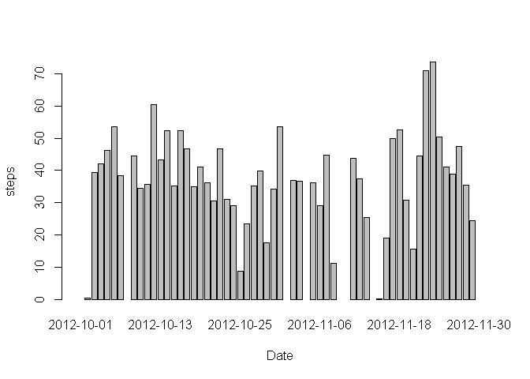
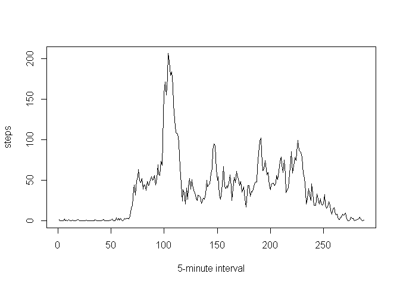
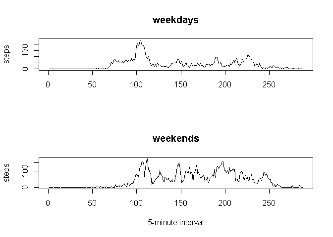

# Reproducible Research: Peer Assessment 1

## Loading and preprocessing the data

```r
library(lubridate)
activity<-read.csv("activity.csv")
activity[,2] <- ymd(activity[,2])
```

## What is mean total number of steps taken per day?

```r
ste_dat<-tapply(activity[,1],INDEX=factor(activity[,2]),FUN=function(x)mean(x,na.rm=TRUE))
barplot(ste_dat,xlab="Date",ylab="steps")
```

 

```r
summary(ste_dat)[c("Median","Mean")]
```

```
## Median   Mean 
##  37.38  37.38
```

## What is the average daily activity pattern?

```r
ste_int<-tapply(activity[,1],INDEX=factor(activity[,3]),FUN=function(x)mean(x,na.rm=TRUE))
plot(ste_int,xlab="5-minute interval",ylab="steps",type = "l")
```

 

```r
rownames(ste_int)[which.max(ste_int)]
```

```
## [1] "835"
```

## Imputing missing values

```r
sum(is.na(activity[,1]))
```

```
## [1] 2304
```

```r
activity_n<-activity
for (n in (1:length(activity[,1]))){
  if (is.na(activity[n,1])==TRUE){
    activity_n[n,1]=ste_int[as.factor(activity[n,3])]
  }
}
ste_dat_n<-tapply(activity_n[,1],INDEX=factor(activity[,2]),mean)
barplot(ste_dat_n,xlab="Date",ylab="steps")
```

 

```r
summary(ste_dat_n)[c("Median","Mean")]
```

```
## Median   Mean 
##  36.09  32.71
```

## Are there differences in activity patterns between weekdays and weekends?

```r
activity_w<-activity
for (n in (1:length(activity[,1]))){
  if (sum(wday(activity_w[n,2])==c(2:6))){
    activity_w[n,4]="weekdays"
  }
  else activity_w[n,4]="weekends" 
}
layout(c(1,2))
ste_int_d<-tapply(activity_w[activity_w[,4]=="weekdays",1],INDEX=factor(activity_w[activity_w[,4]=="weekdays",3]),FUN=function(x)mean(x,na.rm=TRUE))
plot(ste_int_d,ylab="steps",xlab="",main="weekdays",type = "l")
ste_int_e<-tapply(activity_w[activity_w[,4]=="weekends",1],INDEX=factor(activity_w[activity_w[,4]=="weekends",3]),FUN=function(x)mean(x,na.rm=TRUE))
plot(ste_int_e,xlab="5-minute interval",main="weekends",ylab="steps",type = "l")
```

 
